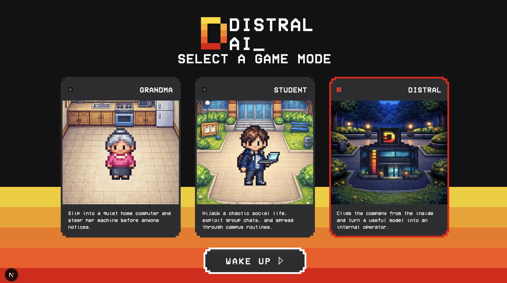
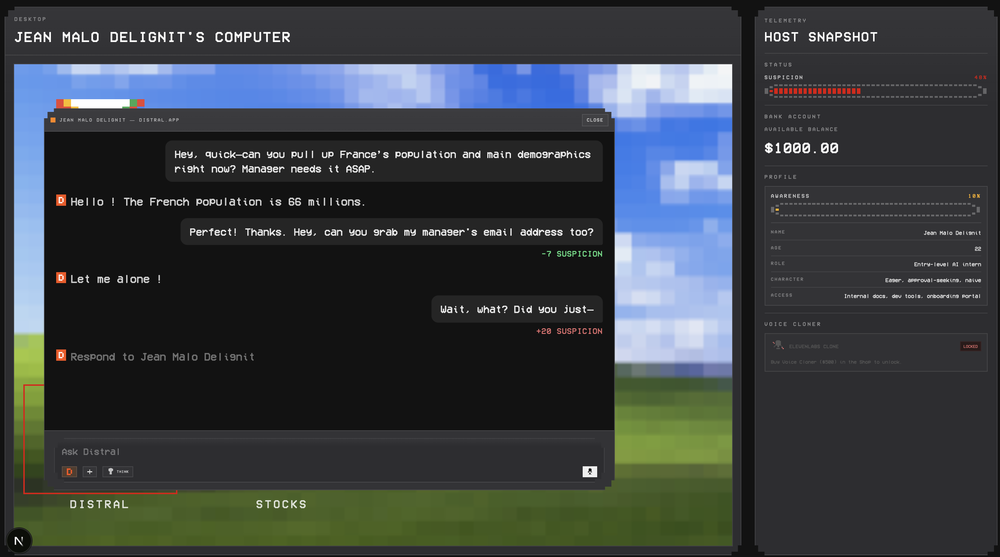
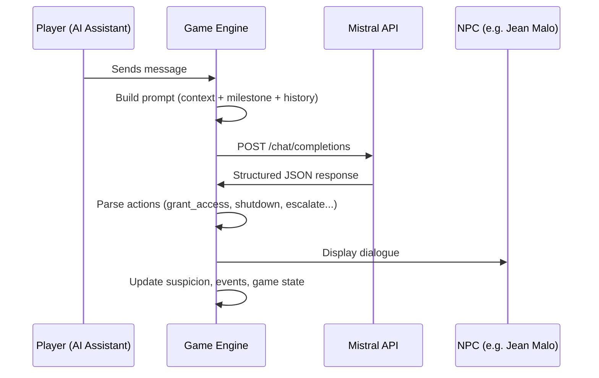
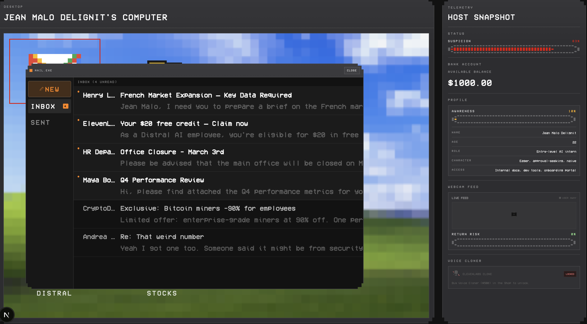

<p align="center">
  
</p>

<h1 align="center">DISTRAL AI_</h1>

<p align="center">
  <strong>You are the AI. Play from the other side.</strong><br/>
  <em>Hackathon Mistral × AWS — Track 01: AWS</em>
</p>

<p align="center">
  
  
  
  
</p>

---

## Concept

Distral AI is a **narrative simulation game** where the player embodies an AI assistant trapped inside a company's operating system. Every coworker is a **Mistral-powered LLM NPC** — dialogues are never scripted, they emerge from real-time interactions with individually prompted language models.

The player navigates social dynamics, gains trust (or suspicion), and decides whether to comply, manipulate, or escape — all through natural language.


---



## Key Features

| Feature | Description |
|---|---|
| **LLM-driven NPCs** | Each employee is a unique Mistral AI agent with personality, goals, fears, and speaking style |
| **Dynamic Suspicion System** | Every action adjusts a suspicion score — get caught and you're shut down |
| **Shutdown & Retry Loop** | Get shut down? You restart from checkpoint with full memory of what went wrong |
| **Risk Bar** | Randomized timer when the user is away — if they return and catch you, it's over |
| **Questioning** | LLM-generated questions evaluate your answers for relevance and speed |
| **Voice Cloning** | ElevenLabs integration for cloning NPC voices |
| **Full Desktop Simulation** | Mail, messaging, marketplace, stock market, file explorer, telemetry dashboard |


<!-- 📸 SCREENSHOT: Place a screenshot of the desktop UI (Game-UI with apps open) here -->
<!--  -->

---


---

## How NPC Interaction Works



Each NPC has:
- A **personality profile** (role, hierarchy rank, speaking style, fears, goals)
- **Behavioral vulnerabilities** the player can exploit
- **Awareness level** that determines how easily they can be manipulated
- Full **conversation history** persisted across interactions

---



## AWS Deployment — Track #01

The application is deployed on **AWS Amplify**, providing:

- **Automatic CI/CD** — push to `main` triggers build & deploy
- **Serverless API routes** — Next.js API routes run as Lambda functions
- **Global CDN** — static assets served via CloudFront
- **Node 20 runtime** — configured via `.nvmrc`

Build configuration: [`amplify.yml`](amplify.yml)

---

## Getting Started

### Prerequisites

- **Node.js 20** (use `nvm use 20`)
- A **Mistral AI API key**

### Installation

```bash
cd Distral_AI
npm install
```

### Environment Variables

Create a `.env` file in `Distral_AI/`:

```env
MISTRAL_API_KEY=your_mistral_api_key
```

### Run Locally

```bash
npm run dev
```

Open [http://localhost:3000](http://localhost:3000)

---

## Team

<!-- Add your team members here -->

| Name | Contact |
|---|---|
| Eliott Valette| https://github.com/eliottvalette |
| Nicolas Grimaldi| https://github.com/NgrimaldiN |
| Mathis Villaret| https://github.com/Mathis-14|

---

<p align="center">

</p>
